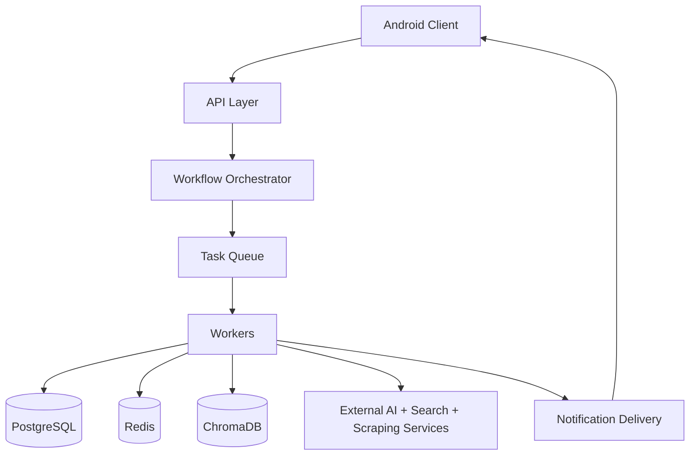

# HuntFact

HuntFact helps you quickly check whether claims in short videos are true, false, partially true, or unclear.  
Share a reel to HuntFact, and you get a clean, claim-by-claim report with plain-language explanations and source links you can open and verify yourself.

> Try the first release APK: [v1.0.0](https://github.com/Avngrstark62/huntfact/releases/tag/v1.0.0)

---

## 👤 User Flow

| Step | What happens |
|---|---|
| 1 | Share an Instagram reel to HuntFact from your phone's share sheet |
| 2 | HuntFact confirms your request and starts processing |
| 3 | You continue using your phone while HuntFact works in the background |
| 4 | You get a notification when your fact-check is ready |
| 5 | Open the result to view each claim with verdict, explanation, and sources |

---

## ✨ Feature List

| Feature | Description |
|---|---|
| Share-to-check | Start a hunt directly from shared Instagram reel links |
| Authenticated usage | Google sign-in with per-user hunt history |
| Async processing | Long-running verification without blocking app UX |
| Structured verdicts | Claim-level verdict, explanation, and source URLs |
| Hunt tracking | Status lifecycle: queued -> processing -> completed/failed |
| Notifications | Push updates when hunt results are ready |
| Result UX | Verdict filters + claim search for easy review |

---

## 🏗️ Architecture (Including Pipeline)

### High-Level Architecture

### Pipeline

```mermaid
flowchart LR
    A[Extract Audio] --> B[Parallel Transcription]
    B --> C[Transcript Correction]
    C --> D[Translate]
    D --> E[Extract Claim Clusters]
    E --> F[Fetch URLs]
    F --> G[Scrape Web Context]
    G --> H[Store/Retrieve Context]
    H --> I[Claim Verification]
    I --> J[Merge Cluster Results]
    J --> K[Save Result + Update Status]
    K --> L[Notify User]
```

**Architecture roles**
- **Android Client**: request creation, hunt tracking, result rendering, notification handling.
- **API Layer**: authenticated endpoints, health checks, request admission, hunt lifecycle entrypoint.
- **Orchestrator + Workers**: step sequencing, fanout/fanin, retry-safe async execution.
- **Infra/Data**: queueing, persistence, retrieval, and outbound notifications.

---

## 🧰 Tech Stack

| Layer | Stack |
|---|---|
| Mobile | Kotlin, Jetpack Compose, WorkManager, Retrofit |
| Auth & Notifications | Supabase Auth (Google OAuth), Firebase Cloud Messaging |
| Backend | Python, FastAPI, Pydantic |
| Async Processing | RabbitMQ-based orchestrator/worker model |
| Data | PostgreSQL, SQLAlchemy, Alembic, Redis |
| Retrieval/Intelligence | ChromaDB, LLM APIs, transcription services, web search/scraping |

---

## ⚠️ Known Limitations

- Verdicts can still be brittle in some edge cases; claim verification is not fully robust yet.
- Current system is tuned mainly for objective, checkable factual claims.
- It does not perform well for claims where reliable evidence is not publicly available on the internet.

---

## 🚀 Upcoming Features

- Support for subjective claims using argument analysis based on the Toulmin model.
- Support for additional short-form platforms, including YouTube Shorts.

---

## License

This project is licensed under [Apache 2.0](LICENSE).

---

## 🤝 Contribution

We are currently preparing HuntFact for open-source contributions.

- Please open issues for bugs, feature ideas, or improvement proposals.
- If you have suggestions for claim-verification quality, share concrete examples in an issue.

---

## 📬 Contact

- Email: `abhijeet@huntfact.com`
