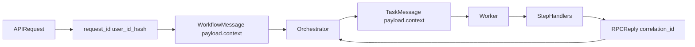

# Backend Logging Observability Plan

## Current Logging Implementation (Backend Only)

- **Central setup exists but is minimal** in [backend/logging_config.py](backend/logging_config.py): stdlib `logging`, single `StreamHandler`, plain text formatter, hardcoded `INFO` level, module loggers via `get_logger()`.
- **Initialization is repeated per process** in [backend/main.py](backend/main.py), [backend/app.py](backend/app.py), [backend/worker.py](backend/worker.py), [backend/orchestrator.py](backend/orchestrator.py), [backend/workflow_cleanup.py](backend/workflow_cleanup.py).
- **API logging is route-level, not request-level** in [backend/router.py](backend/router.py) and [backend/auth/supabase_auth.py](backend/auth/supabase_auth.py); there is no global HTTP middleware/access logging for method/status/latency/request id.
- **RabbitMQ consumer paths log lifecycle and quarantine events** in [backend/rmq/consumer.py](backend/rmq/consumer.py), but **publisher paths are largely silent** in [backend/rmq/publisher.py](backend/rmq/publisher.py).
- **Orchestrator and worker log heavily but unstructured** in [backend/orchestrator.py](backend/orchestrator.py) and [backend/worker.py](backend/worker.py) with mixed formatting styles and component tag conventions.
- **Service logging varies widely** across [backend/services/](backend/services/) with mostly unstructured `info/error`; one module uses `print()` directly ([backend/services/reel_extractor/reel_extractor.py](backend/services/reel_extractor/reel_extractor.py)).
- **DB access layer is mostly silent** in [backend/db/database.py](backend/db/database.py), so persistence-side failures/latency lack operational context.

## Key Problems in Current Approach

- **Inconsistent log style and schema**
  - Mixed `%s`, f-strings, and bracketed text tags (`[TASK HANDLER]`, `[TASK_CONSUMER]`).
  - No standardized event names or machine-parseable fields.
- **Weak correlation across components**
  - API request context is not propagated through RMQ/orchestrator/worker/handlers.
  - `correlation_id` exists for RPC but is not surfaced in normal logs.
  - `TaskMessage` in [backend/rmq/schemas.py](backend/rmq/schemas.py) lacks a shared context envelope (request/workflow/hunt identifiers).
- **Missing baseline access telemetry**
  - No system-wide per-request logs (method/path/status/duration/auth outcome).
- **Noisy or risky logging patterns**
  - Some logs print full payload objects (e.g., translate/cluster outputs in [backend/orchestrator.py](backend/orchestrator.py)).
  - Sensitive-ish fields logged raw in places (user IDs, full URLs, queries).
- **Uneven exception detail policy**
  - Some code uses `exc_info=True`; some expected failures are logged as `info`; some failure logs omit traceback and/or cause.
- **Configuration rigidity**
  - No env-driven log level/format toggle in [backend/config.py](backend/config.py); hardcoded INFO in setup.

## Logging Specification (Backend Standard)

### 1) Logging schema

- **Mandatory fields for every log event**
  - `timestamp` (ISO8601 UTC)
  - `level` (`DEBUG|INFO|WARNING|ERROR|CRITICAL`)
  - `service` (fixed value: `huntfact-backend`)
  - `component` (e.g., `api`, `rmq.publisher`, `rmq.consumer`, `orchestrator`, `worker`, `service.url_fetcher`)
  - `event` (standardized vocabulary; no free-form operation naming)
  - `status` (`started|succeeded|failed|retrying|timed_out|cancelled|quarantined|skipped`)
  - `message` (short human-readable summary; event remains primary query key)
- **Common optional fields (all components)**
  - `request_id`, `workflow_id`, `task_id`, `hunt_id`, `step`
  - `duration_ms`, `attempt`, `max_attempts`
  - `error_type`, `error_message`, `stacktrace` (failure paths only)
- **API-only fields**
  - `method`, `path`, `status_code`, `client_ip`, `auth_outcome`, `user_id_hash`
- **RabbitMQ-only fields**
  - `queue`, `routing_key`, `exchange`, `message_id`, `correlation_id`, `reply_to`, `delivery_tag`, `redelivered`, `prefetch_count`
- **Worker/orchestrator-only fields**
  - `step_priority`, `rpc_mode` (`true|false`), `result_summary` (counts only, never full payload dumps)
- **External-provider boundary fields**
  - `provider` (`openai|assemblyai|firecrawl|searxng|chromadb|firebase`)
  - `operation` (e.g., `transcribe`, `scrape`, `search`, `upsert`, `send_notification`)
  - `http_status` (when available), `timeout_ms` (when configured), `retryable` (`true|false`)
- **Data safety constraints**
  - Never log raw tokens, authorization headers, full transcript/body content, or URL query parameters.
  - Use masked/hashed forms for user identifiers and FCM/device tokens.

### 2) Standard event vocabulary

- **HTTP/API events**
  - `http.request.received`
  - `http.request.completed`
  - `http.request.failed`
  - `auth.check.started`
  - `auth.check.succeeded`
  - `auth.check.failed`
- **Workflow events**
  - `workflow.admission.started`
  - `workflow.admission.succeeded`
  - `workflow.admission.failed`
  - `workflow.started`
  - `workflow.completed`
  - `workflow.failed`
  - `workflow.cancelled`
- **Task/step events**
  - `task.publish.started`
  - `task.publish.succeeded`
  - `task.publish.failed`
  - `task.started`
  - `task.succeeded`
  - `task.failed`
  - `task.retrying`
  - `task.timed_out`
  - `task.cancelled`
- **RabbitMQ transport events**
  - `rmq.connection.started`
  - `rmq.connection.succeeded`
  - `rmq.connection.failed`
  - `rmq.consume.started`
  - `rmq.message.received`
  - `rmq.message.acked`
  - `rmq.message.rejected`
  - `rmq.message.quarantined`
  - `rmq.publish.started`
  - `rmq.publish.succeeded`
  - `rmq.publish.failed`
  - `rmq.rpc.reply.received`
  - `rmq.rpc.reply.failed`
- **Data and integration events**
  - `db.query.started`
  - `db.query.succeeded`
  - `db.query.failed`
  - `db.write.started`
  - `db.write.succeeded`
  - `db.write.failed`
  - `provider.request.started`
  - `provider.request.succeeded`
  - `provider.request.failed`
  - `provider.request.timed_out`

### 3) Lifecycle logging conventions

- **Every major operation emits at least two events**
  - `*.started` at operation entry.
  - One terminal event: `*.succeeded` or `*.failed` (or `*.cancelled`/`*.timed_out` when applicable).
- **Retries**
  - Emit `*.retrying` exactly once per retry attempt with `attempt`, `max_attempts`, and next delay.
  - Final terminal state remains `*.succeeded` or `*.failed`.
- **Timeouts**
  - Emit `*.timed_out` when timeout threshold is crossed, include `timeout_ms`.
  - If timeout leads to retry, follow with `*.retrying`.
- **Cancellation**
  - Emit `*.cancelled` when signal- or control-driven cancellation is processed.
- **Failure logging policy**
  - Expected business failures: `WARNING` without stacktrace unless required.
  - Unexpected exceptions: `ERROR` with stacktrace.
- **Payload verbosity**
  - Log aggregate metrics (counts/lengths/durations), not full result documents.

### 4) Identifier definitions and propagation contract

- **`request_id`**
  - Purpose: correlate all logs originating from one inbound HTTP request.
  - Source: HTTP header `X-Request-ID` if present; otherwise generated in API middleware.
  - Propagation: `request.state` -> `WorkflowMessage.payload.context` -> `TaskMessage.payload.context`.
- **`workflow_id`**
  - Purpose: correlate full asynchronous hunt workflow across orchestrator and workers.
  - Source: workflow admission layer (currently deterministic hash in [backend/services/workflow_admission/workflow_admission.py](backend/services/workflow_admission/workflow_admission.py)).
  - Propagation: workflow message and every downstream task context.
- **`task_id`**
  - Purpose: identify one step execution attempt in worker/orchestrator logs.
  - Source: generated when emitting each `TaskMessage` (UUID per publish).
  - Propagation: inside `TaskMessage.payload.context` and copied to worker/handler logs.
- **`correlation_id`**
  - Purpose: RabbitMQ RPC request/reply pairing only.
  - Source: [backend/rmq/publisher.py](backend/rmq/publisher.py) for RPC calls.
  - Propagation: AMQP property only; logged at publish/request/reply points.
- **`hunt_id`**
  - Purpose: business entity identifier for user-facing hunt record.
  - Source: DB-created hunt id in API layer.
  - Propagation: request context, workflow payload, task payloads where relevant.
- **Non-overlap rule**
  - `request_id` traces inbound API request lifecycle.
  - `workflow_id` traces async business workflow lifecycle.
  - `task_id` traces a single step execution attempt.
  - `correlation_id` traces RMQ RPC transport pairing.

### 5) System boundaries and minimum logging expectations

- **HTTP boundary** ([backend/app.py](backend/app.py), [backend/router.py](backend/router.py), [backend/auth/supabase_auth.py](backend/auth/supabase_auth.py))
  - Must log request receive/completion/failure with `request_id`, method/path/status/duration.
  - Must log auth check outcome with `request_id`, `auth_outcome`, and masked user context.
- **RabbitMQ boundary** ([backend/rmq/connection.py](backend/rmq/connection.py), [backend/rmq/publisher.py](backend/rmq/publisher.py), [backend/rmq/consumer.py](backend/rmq/consumer.py))
  - Must log connect/disconnect, publish start/result, consume receive/ack/reject/quarantine.
  - Must include queue/routing/correlation/message metadata on transport events.
- **Orchestrator boundary** ([backend/orchestrator.py](backend/orchestrator.py))
  - Must log workflow start, each step start/end/failure, workflow terminal state.
  - Must include `workflow_id`, `hunt_id`, `step`, `task_id`, `duration_ms`.
- **Worker/handler boundary** ([backend/worker.py](backend/worker.py), [backend/services/*/handler.py](backend/services/*/handler.py))
  - Must log task start/end/failure with task and workflow context.
  - For RPC, must log reply publish success/failure with `correlation_id`.
- **Database boundary** ([backend/db/database.py](backend/db/database.py))
  - Must log write/read operation start/fail/success with operation name and key ids (no SQL text or raw payloads).
- **External providers boundary** ([backend/services/transcriber/openai.py](backend/services/transcriber/openai.py), [backend/services/transcriber/assemblyai.py](backend/services/transcriber/assemblyai.py), [backend/services/firecrawl/firecrawl.py](backend/services/firecrawl/firecrawl.py), [backend/services/url_fetcher/url_fetcher.py](backend/services/url_fetcher/url_fetcher.py), [backend/chroma_client.py](backend/chroma_client.py), [backend/services/notification_sender/notification_sender.py](backend/services/notification_sender/notification_sender.py))
  - Must log request start/success/failure/timeout with `provider`, `operation`, `duration_ms`, and sanitized target metadata.

## Structured Logging Approach (Fits Existing Code)

- **Keep stdlib logging** (no large rewrite).
  - Extend [backend/logging_config.py](backend/logging_config.py) with:
    - `JsonFormatter` (custom small formatter) and existing text formatter.
    - Env-driven switches: `LOG_FORMAT=text|json`, `LOG_LEVEL`, optional `LOG_INCLUDE_SOURCE`.
  - Preserve `get_logger()` and existing logger hierarchy (`huntfact.*`).
- **Adopt an event-first contract** using the specification above.
  - Message text is secondary; `event` and typed fields are primary.
  - Add helper wrappers (e.g., `log_event(logger, level, event, **fields)`) to reduce boilerplate and enforce schema.
- **No framework/library churn initially**
  - Do not introduce `structlog`/new infra now; revisit only if stdlib+JSON proves insufficient.

## Context Propagation Design (request/pipeline/task IDs)

- **HTTP boundary**
  - Add request-id middleware in [backend/app.py](backend/app.py): read `X-Request-ID` if present, else generate UUID; attach to `request.state` and response header.
- **Workflow boundary**
  - Include `context` inside `WorkflowMessage.payload` in [backend/router.py](backend/router.py) with `request_id`, `hunt_id`, optional `user_id_hash`.
- **Orchestrator to worker boundary**
  - Include same `context` in every `TaskMessage.payload` emitted from [backend/orchestrator.py](backend/orchestrator.py).
- **Worker and handlers**
  - Extract `context` once in [backend/worker.py](backend/worker.py) and pass through to handler logs (without changing business behavior).
- **RabbitMQ RPC correlation**
  - Log generated `correlation_id` at publish + response points in [backend/rmq/publisher.py](backend/rmq/publisher.py), and include it in worker reply logs.

## Incremental Migration Plan (Non-Breaking, Spec-Driven)

1. **Phase 1 - Freeze and publish the logging specification**
   - Add the finalized schema, event vocabulary, lifecycle conventions, identifier contract, and boundary minimums as the implementation source of truth.
   - Define lint/check rules for forbidden patterns (`print(` in backend runtime paths, free-form event names, unsafe fields).

2. **Phase 2 - Logging foundation (no behavior change)**
   - Update [backend/config.py](backend/config.py) with `LoggingSettings`.
   - Upgrade [backend/logging_config.py](backend/logging_config.py) to support text/json format and levels via env.
   - Keep default output backward-compatible (`text`, `INFO`) while including spec field support.

3. **Phase 3 - Standard contract helpers**
   - Add lightweight helpers in logging module for:
     - event logging API that validates schema and event vocabulary,
     - field sanitization (mask/hash user id, strip URL query),
     - safe exception serialization (`error_type`, `error_message`).
   - Add shared context builder/parser utilities for `request_id`, `workflow_id`, `task_id`, `hunt_id`.

4. **Phase 4 - API request observability**
   - Add middleware in [backend/app.py](backend/app.py) for request start/end logs + request id propagation.
   - Normalize auth logs in [backend/auth/supabase_auth.py](backend/auth/supabase_auth.py) to structured fields; fix mixed string-format usage.
   - Update route logs in [backend/router.py](backend/router.py) to use event names and context fields.

5. **Phase 5 - RMQ and orchestration instrumentation**
   - Add publish/consume logs in [backend/rmq/publisher.py](backend/rmq/publisher.py) and [backend/rmq/consumer.py](backend/rmq/consumer.py) with queue/routing/correlation fields.
   - In [backend/orchestrator.py](backend/orchestrator.py), log step boundaries with spec events; replace large payload dumps with counts/summaries.
   - Ensure context propagation (`request_id`, `workflow_id`, `hunt_id`, `task_id`, `step`) across task payloads.

6. **Phase 6 - Worker and handler alignment**
   - Refactor repetitive step logs in [backend/worker.py](backend/worker.py) to shared structured pattern.
   - Standardize handler start/end/error logs across [backend/services/*/handler.py](backend/services/*/handler.py) using propagated context.
   - Replace `print()` usage in [backend/services/reel_extractor/reel_extractor.py](backend/services/reel_extractor/reel_extractor.py) with logger usage (only if module remains active).

7. **Phase 7 - Boundary hardening (services and DB)**
   - Normalize service logs in high-impact modules first:
     - [backend/services/firecrawl/firecrawl.py](backend/services/firecrawl/firecrawl.py)
     - [backend/services/url_fetcher/url_fetcher.py](backend/services/url_fetcher/url_fetcher.py)
     - [backend/services/save_result_to_db/save_result_to_db.py](backend/services/save_result_to_db/save_result_to_db.py)
   - Add operation-level logs in [backend/db/database.py](backend/db/database.py) around reads/writes/failures without per-row noise.
   - Instrument external provider boundary events consistently (`provider.request.*`).

8. **Phase 8 - Rollout controls and verification**
   - Roll out JSON format behind env flag in non-prod first.
   - Verify key flows: `/start-hunt` -> workflow queue -> orchestrator steps -> worker RPC -> DB save -> notify.
   - Confirm searchable traces by `request_id`/`workflow_id`/`task_id`/`hunt_id` end-to-end.
   - Validate that emitted events match the standardized vocabulary and lifecycle rules.

## Architectural Reasoning

- **Why stdlib logging first:** already used everywhere; lowest migration risk and fastest incremental adoption.
- **Why context-in-payload propagation:** current system is async/RabbitMQ-driven; explicit payload context is the most reliable and debuggable way to preserve traceability across process boundaries.
- **Why minimal field set:** production observability needs stable, queryable dimensions without flooding logs or leaking sensitive data.
- **Why phased migration:** allows shipping observability improvements safely while preserving existing behavior and avoiding a risky cross-cutting rewrite.
