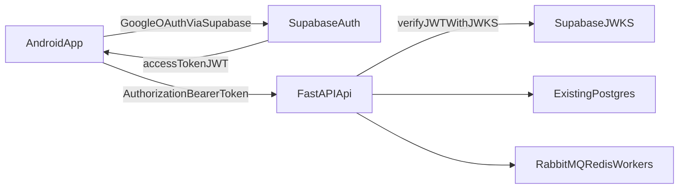

# Supabase Auth Integration Spec (Google OAuth Only)

## Overview

Integrate Supabase Auth for user authentication while keeping the existing backend database and pipeline architecture unchanged.  
Scope is limited to:

- Supabase Auth as identity provider
- Google OAuth as the only login method
- Backend authorization on protected endpoints via Supabase JWT verification
- Android app sign-in flow and token propagation to backend

Out of scope:

- Migrating application data to Supabase Postgres
- Replacing Firebase notifications
- Reworking RabbitMQ/Redis pipeline

## Current Codebase Baseline

- Backend (`FastAPI`):
  - Public endpoint `POST /start-hunt` in `backend/router.py`
  - Request body contains `video_link`, `cdn_link`, `fcm_token`
  - No user identity in request context or DB model
- Android app:
  - Calls `/start-hunt` via Retrofit in `android/app/src/main/java/com/example/android/network/ApiService.kt`
  - No auth token in network layer
  - WorkManager worker triggers API call from `ReelProcessingWorker.kt`

## Target Architecture

## Phase 1 - Supabase Project Setup

1. Create/confirm Supabase project.
2. Enable Google provider in Supabase Auth settings.
3. Configure OAuth redirect URIs for Android (deep link/callback URI).
4. Capture required secrets/config:
   - `SUPABASE_URL`
   - `SUPABASE_ANON_KEY` (Android)
   - `SUPABASE_JWKS_URL` (backend, usually `https://<project-ref>.supabase.co/auth/v1/.well-known/jwks.json`)
   - `SUPABASE_ISSUER` (backend, usually `https://<project-ref>.supabase.co/auth/v1`)
   - `SUPABASE_AUDIENCE` if required by token validation policy

## Phase 2 - Backend Auth Guard (FastAPI)

### Files to change

- `backend/config.py`
- `backend/schemas.py`
- `backend/router.py`
- `backend/pyproject.toml`

### Backend implementation details

1. **Config additions** (`backend/config.py`)
   - Add typed settings for Supabase JWT verification:
     - `supabase_url`
     - `supabase_jwks_url`
     - `supabase_issuer`
     - `supabase_audience` (optional/default)
   - Keep loaded from `.env`.

2. **JWT verification utility**
   - Add a small auth module (for example `backend/auth/supabase_auth.py`) with:
     - Bearer token extraction from `Authorization` header
     - JWKS-based signature verification
     - Claim checks (`iss`, `exp`, and `aud` if configured)
     - Return normalized user identity (`sub`, `email`)
   - Cache JWKS in memory with TTL to avoid per-request fetch.

3. **Route protection** (`backend/router.py`)
   - Add FastAPI dependency for authenticated user.
   - Protect `POST /start-hunt` with this dependency.
   - On success, inject user identity in request context for authorization only.
   - Return `401` on missing/invalid token.

4. **Request/response contracts** (`backend/schemas.py`)
   - Keep existing request shape for minimal client disruption.
   - Add optional response field if needed for user-scoped metadata (not required initially).

5. **Dependencies** (`backend/pyproject.toml`)
   - Add JWT/JWKS libs for robust verification (for example `python-jose[cryptography]` or equivalent).

## Phase 3 - Android Google OAuth via Supabase

### Files to change

- `android/app/build.gradle.kts`
- `android/app/src/main/AndroidManifest.xml`
- `android/app/src/main/java/com/example/android/network/RetrofitClient.kt`
- `android/app/src/main/java/com/example/android/network/ApiService.kt`
- `android/app/src/main/java/com/example/android/workers/ReelProcessingWorker.kt`
- `android/app/src/main/java/com/example/android/MainActivity.kt`
- `android/app/src/main/java/com/example/android/utils/*` (new auth/session manager)

### Android implementation details

1. **Add Supabase Kotlin client dependency**
   - Include Supabase Auth SDK and required Ktor/coroutines modules.

2. **Initialize Supabase client**
   - Create singleton client wrapper with:
     - `SUPABASE_URL`
     - `SUPABASE_ANON_KEY`
   - Store config via Gradle `BuildConfig` fields (no hardcoded values).

3. **Google OAuth sign-in flow**
   - Add sign-in action in `MainActivity` (or dedicated auth screen).
   - Trigger Supabase Google OAuth.
   - Handle callback/deep link and persist session.

4. **Session/token manager**
   - Add utility to read current access token safely.
   - Expose `getAccessToken(): String?` used by worker/network layer.

5. **Attach bearer token on API calls**
   - Update Retrofit client with an OkHttp interceptor:
     - Adds `Authorization: Bearer <token>` when token exists.
   - Keep current request body unchanged.

6. **Worker auth handling**
   - In `ReelProcessingWorker.kt`, verify valid session before calling backend.
   - If no valid session:
     - fail gracefully
     - surface notification asking user to sign in again

## Phase 4 - Authorization Behavior and Compatibility

1. Enforce auth only on `POST /start-hunt` first.
2. Keep `/health` public.
3. Existing hunt persistence and dedupe logic remain unchanged in this phase.
4. Error contract:
   - `401` for auth failures
   - existing `503` behavior remains for infra health checks

## Security and Operational Requirements

- Never trust user IDs from request body; derive identity only from verified JWT.
- Validate token issuer strictly against Supabase issuer.
- Keep anon key only on Android; never expose service role key.
- Add minimal structured auth logs on backend (user id + endpoint + outcome, no token logging).

## Rollout Plan

1. Backend token verification + protected `/start-hunt`.
2. Android sign-in + bearer propagation.
3. Hardening pass (error handling, retries, session refresh UX).

## Acceptance Criteria

- User can sign in with Google from Android via Supabase.
- Android sends Supabase access token to backend in Authorization header.
- Backend accepts valid token and rejects invalid/missing token with `401`.
- Existing DB remains source of truth for hunts/results.
- Pipeline behavior and FCM notifications remain unchanged.
- No schema change to `hunts` is required in this phase.

## Implementation Notes for This Repository

- Keep startup/shutdown orchestration in `backend/app.py` unchanged except required auth init helpers.
- Keep route orchestration style in `backend/router.py`; auth logic should be a dependency helper.
- Preserve existing `StartHuntRequest` payload so `ReelProcessingWorker.kt` requires minimal updates.

